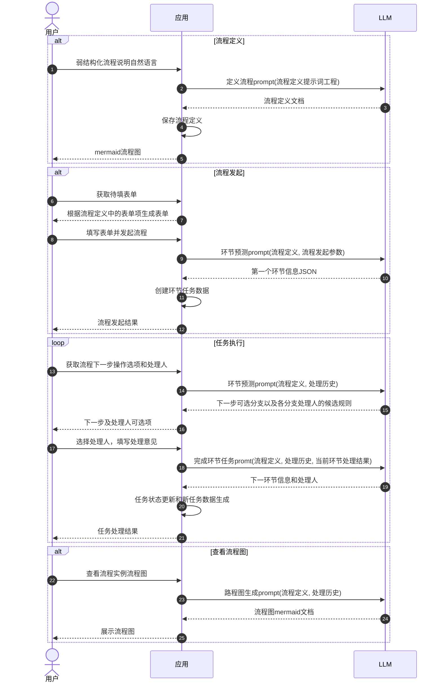

# llm-driven-workflow-engine
基于大语言模型和提示词工程驱动的工作流引擎

## 项目背景
往往业务流程的定义人员不是系统开发人员，所以在需要用到工作流引擎的应用中，通常需要产品经理或需求分析人员将用户提出的需求翻译给开发人员进行实现，然后开发人员花大气力集成类似`flowable`这样的工作流引擎或者自己实现状态控制，实现成本较高，这个过程也比较痛苦。

## 设计目标
通过收集用户**一定结构化**的自然语言输入，使用提示词工程，生成一定规则的流程定义文档，此文档一方面是人类可读的流程定义，另一方面，此文档也会作为上下文内容，在流程流转过程中与大模型交互，参与流程环节的下一步预测、参与执行结果决策等逻辑。

## 主要流程

主要的提示词工程，用在流程的3个主要环节：

### 定义流程
生成流程定义的文档，其中包括：`表单字段`、`角色列表`、`环节列表`、`流转规则`、`流程图`_(`mermaid`)_ 等内容，提示词工程模板定义在 [`prompts/define-workflow.md`](prompts/define-workflow.md)。

### 环节预测
根据流程定义文档加上当前流程实例的处理历史情况和当前环节信息，组装提示词，让大模型以`json`格式返回下一步可执行的操作，以及不同操作的可选下一步执行人选取规则，此处的结构化结果，将返回给系统应用，由应用提供用户交互，指定下一步的处理人。此部分的提示词工程模板定义在 [`prompts/define-workflow.md`](prompts/define-workflow.md)。

### 完成环节任务
当前用户处理人只需要输入一行回复意见，引擎通过分析用户的答复内容，再根据`流程定义`、`执行历史`等上下文内容，自动判断流程应流转到哪个环节、由谁进行处理，以`json`格式返回数据到应用，由应用完成数据的更新以及新任务的创建。此部分提示词工程模板定义在 [`prompts/complete-task.md`](prompts/complete-task.md)。

### 查看流程图
在流程流转过程中或结束后，用户需要查看流程图，可通过应用，将流程实例的`流程定义`和`执行历史`等上下文内容，调用大模型返回相应的`mermaid`代码，由前端进行展示。此部分提示词工程模板定义在 [`prompts/instance-flowchart.md`](prompts/instance-flowchart.md)。

# 补充说明
1. 本仓库是一个探索性的项目，目前仅有一个初步的想法，具体的实现还有待验证。
2. 只着眼于如何将提示词工程用于流程的定义和流转过程，不涉及具体的应用开发代码编写，毕竟编写代码这种事，交给AI去做就行。